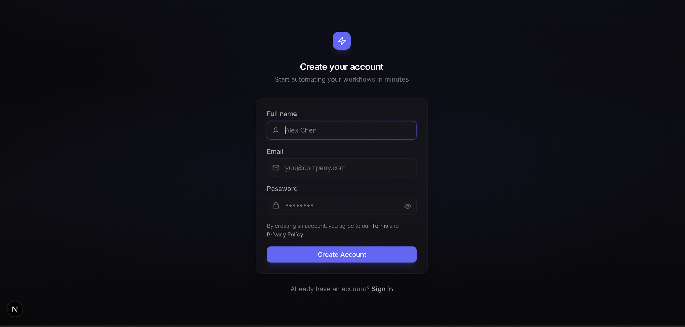
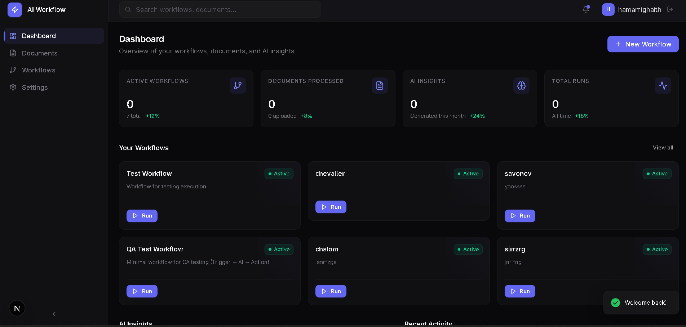
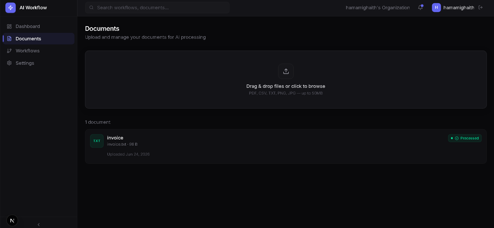
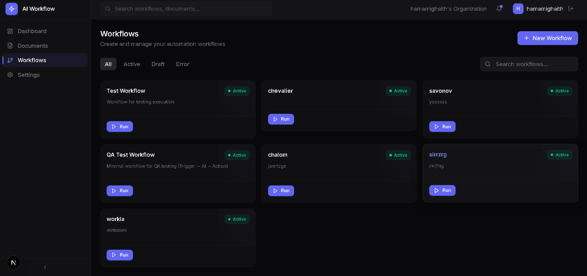
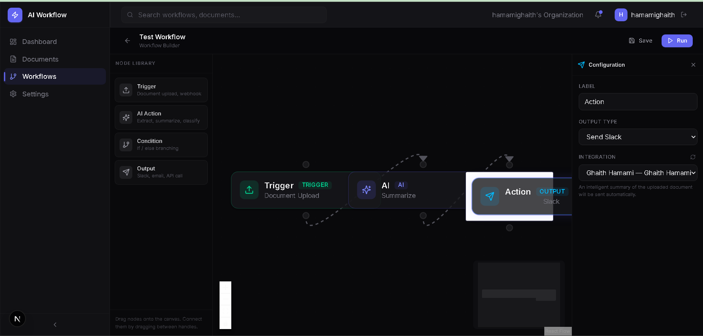
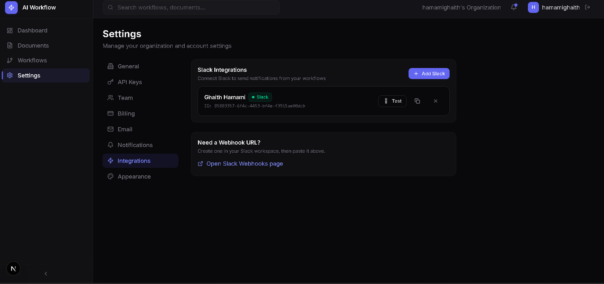

# AI Workflow SaaS

Multi-tenant AI-powered workflow automation platform. Build, run, and monitor intelligent workflows with a visual builder.

## Tech Stack

- **Frontend**: Next.js 16, React 19, TypeScript, Tailwind CSS v4, Framer Motion, XYFlow, Zustand, TanStack Query
- **Backend**: FastAPI, SQLAlchemy, PostgreSQL, Celery, Redis, OpenAI/Groq, Resend
- **Infrastructure**: Docker Compose, Alembic

## Getting Started

### Prerequisites

- Docker & Docker Compose
- Node.js 20+

### 1. Clone and configure

```bash
cp .env.example .env
# Edit .env with your API keys (OpenAI/Groq, Resend, etc.)
```

### 2. Run the backend

```bash
docker compose up --build
```

This starts PostgreSQL, Redis, the FastAPI backend (port 8000), and the Celery worker.

### 3. Run the frontend

```bash
cd frontend
npm install
npm run dev
```

The app is at `http://localhost:3000`.

## Screenshots

| | |
|---|---|
|  |  |
|  |  |
|  |  |
|  | |

## Project Structure

```
├── backend/              # FastAPI application
│   ├── app/
│   │   ├── core/         # Config, DB, security, dependencies
│   │   ├── engine/       # Workflow engine (nodes, triggers, executor)
│   │   ├── models/       # SQLAlchemy models
│   │   ├── routers/      # API routes
│   │   ├── schemas/      # Pydantic schemas
│   │   ├── services/     # Business logic (AI, auth, integrations)
│   │   └── tasks/        # Celery async tasks
│   └── requirements.txt
├── frontend/             # Next.js application
│   └── src/
│       ├── app/          # Pages & layouts
│       ├── components/   # UI components
│       ├── hooks/        # Custom React hooks
│       ├── lib/          # API client, store, utils
│       └── types/        # TypeScript types
├── design-system/        # Design system documentation
├── docker-compose.yml
└── .env.example
```
